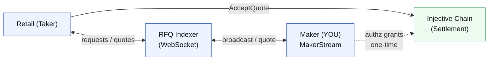

### How it works

1. **Retail user** sends an RFQ request via the **TakerStream** WebSocket.
2. **RFQ Indexer** broadcasts the request to all connected **Makers** via **MakerStream**.
3. **Makers** price, sign, and return a quote over MakerStream.
4. **Indexer** relays quotes back to the taker after a collection window.
5. **Retail user** picks a quote and calls `AcceptQuote` on the RFQ contract.
6. **Contract** verifies the MM signature and settles the trade as a synthetic position.

As a MM, you only:

- Connect to MakerStream
- Receive requests
- Sign and send quotes

You do **not** submit an on-chain transaction for each trade — settlement is the taker's responsibility. The contract enforces your signature cryptographically, so you can't be misquoted.

> **TP/SL note:** since contract `0.1.0-alpha.6` ([#23](https://github.com/InjectiveLabs/rfq/pull/23), [#27](https://github.com/InjectiveLabs/rfq/pull/27)) there is a second settlement path — `AcceptSignedIntent` — used for take-profit / stop-loss exits. The executor handles trigger monitoring and submits settlement on the taker's behalf. From your side as an MM, there is no separate TP/SL integration: when the executor needs liquidity, it emits an ordinary RFQ request and you quote it the usual way.
>
> The wire-level signing and quote shape are identical in both paths. See [TP/SL and makers](/market-makers/integration/rfq-quotes-blind) below.
