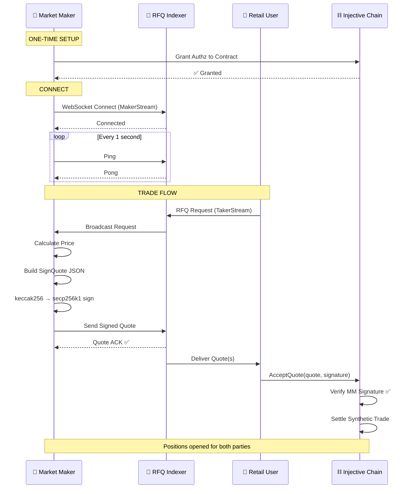
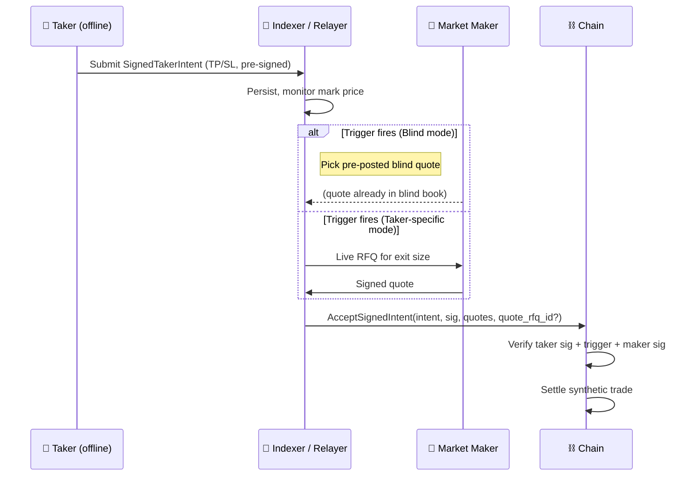

### Full lifecycle (sync `AcceptQuote` path)

### TP/SL path (`AcceptSignedIntent`)

{/* TODO: add detailed TPSL flow doc */}

Summary from your side:

### Supported markets (testnet)

| Market | Symbol | Market ID |
|---|---|---|
| INJ/USDT Perp | `INJ/USDT PERP` | `0x17ef48032cb24375ba7c2e39f384e56433bcab20cbee9a7357e4cba2eb00abe6` |
| ATOM/USDT Perp | `ATOM/USDT PERP` | `0xd97d0da6f6c11710ef06315971250e4e9aed4b7d4cd02059c9477ec8cf243782` |
