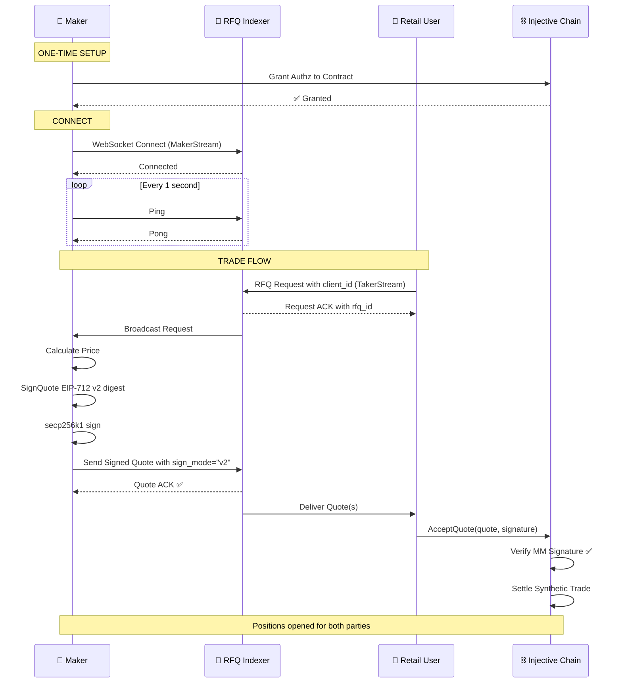
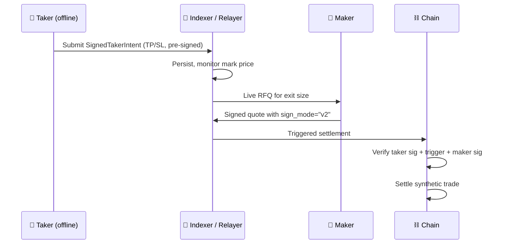

### Full lifecycle (sync `AcceptQuote` path)

### TP/SL path (`AcceptSignedIntent`)

Summary from your side:

### Supported markets (testnet)

| Market | Symbol | Market ID | Price tick |
|---|---|---|---|
| INJ/USDC PERP | `INJ/USDC PERP` | `0xdc70164d7120529c3cd84278c98df4151210c0447a65a2aab03459cf328de41e` | `0.01` |
| BTC/USDC PERP | `BTC/USDC PERP` | `0xfd704649cf3a516c0c145ab0111717c44640d8dbe52a462ae35cadf2f6df1515` | `1` (integer) |
| LINK/USDC PERP | `LINK/USDC PERP` | `0xdbb9bb072015238096f6e821ee9aab7affd741f8662a71acc14ac30ee6b687a5` | `0.001` |
| ETH/USDC PERP | `ETH/USDC PERP` | `0x135de28700392fb1c17d40d5170a74f30055a4ad522feddafec42fbbbb780897` | `0.1` |

<Info>
**Integer-tick canonicalization (BTC)**:

For markets with tick `1`, `str(float(76462))` produces `"76462.0"` which is rejected.
Use `str(int(price))` or `Decimal(...).normalize()`.
The correct canonical form is `"76462"` with no decimal point.
</Info>
