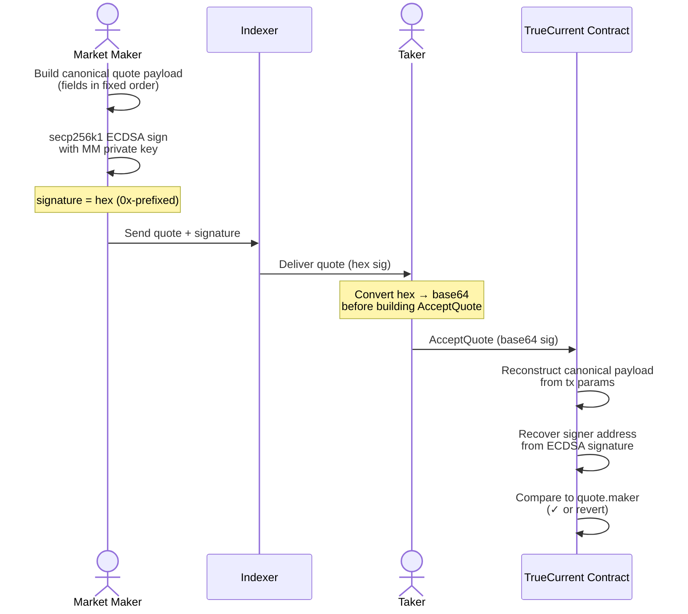

Every quote you submit must be signed with your market maker wallet's private key. This signature is a cryptographic commitment to your quoted terms – it allows the TrueCurrent smart contract to verify authenticity at settlement without requiring you to be online at that moment.

---

## Why quotes must be signed

Signed quotes provide two critical guarantees:

1. **Authenticity.** The contract can verify that this quote genuinely came from your wallet and wasn't tampered with in transit.
2. **Binding commitment.** Once signed and submitted, you cannot alter or retract a quote within its validity window. This protects traders from bait-and-switch pricing.

The signature is verified onchain during the `AcceptQuote` transaction. If the signature is invalid, the transaction reverts.

---

## Flow at a glance



The contract **does not receive** your pre-built payload — it reconstructs the canonical payload from the transaction parameters. Any mismatch between what you signed and what the contract rebuilds causes a verification failure, even if the signature itself is valid for your original bytes.

---

## What is signed

The signature covers the full set of quote parameters, in a specific order and encoding:

- `rfq_id` – the unique request identifier
- `market_id` – the Injective market ID
- `direction` – taker's direction (`long` or `short`)
- `taker` – taker's Injective address
- `taker_margin` – taker's margin amount
- `taker_quantity` – taker's quantity
- `maker` – your Injective address
- `maker_margin` – your margin commitment
- `maker_quantity` – quantity you're filling
- `price` – your quoted price
- `expiry` – quote expiry timestamp (Unix ms)
- `chain_id` – Injective chain ID (prevents cross-chain replay)
- `contract_address` – TrueCurrent contract address (prevents cross-contract replay)

**Correct field ordering and encoding is critical.** The smart contract reconstructs the signed message from the settlement transaction parameters and verifies it against your signature. Any mismatch – including wrong field order, incorrect number encoding, or wrong encoding format – will cause a signature verification failure and rejected settlement.

---

## Signing in Python

Using the `rfq_test` library:

```python
from rfq_test.crypto.signing import sign_quote

signature = sign_quote(
    private_key=mm_wallet.private_key,   # raw private key bytes or hex string
    rfq_id=str(rfq_id),                  # stringify the integer rfq_id
    market_id=market_id,
    direction="long",                     # taker's direction
    taker=taker_wallet.inj_address,
    taker_margin="200",                   # string representation of USDT amount
    taker_quantity="100",                 # string representation of contracts
    maker=mm_wallet.inj_address,
    maker_margin="200",
    maker_quantity="100",
    price="4.4550",                       # string with 4 decimal places
    expiry=quote_expiry,                  # Unix millisecond timestamp as int
    chain_id=chain_id,                    # e.g., "injective-1" for mainnet
    contract_address=contract_address,   # TrueCurrent contract addr
)
```

The returned `signature` is a hex string that you include in your quote payload.

---

## Common signing errors

**`signature verification failed`** – The most common cause is incorrect field serialization. Check:
- Are you using the correct field order?
- Are numeric values encoded as strings (not raw integers)?
- Is the price string in the correct decimal format?

**`quote expired`** – Your quote's `expiry` timestamp was in the past by the time the trader accepted. Ensure your system clocks are synchronized (use NTP) and set a sufficient expiry window. {/* TODO: confirm the precise minimum quote expiry once benchmarked */}

**`unauthorized` / wrong maker address** – The signing wallet doesn't match the `maker` field in your quote, or the `maker` address is not whitelisted.

**`invalid chain_id`** – You're using testnet chain ID on mainnet or vice versa. Verify your environment configuration.

---

## Security considerations

Your private key is used to sign quotes. Treat it with the same care as any high-value cryptographic secret:

- Never hardcode private keys in source code or commit them to version control
- Use environment variables or a dedicated secrets management system
- Consider using a hardware security module (HSM) for production market making
- Your signing key only needs to be able to sign messages – it doesn't need to hold large balances directly if you structure your wallet setup carefully
