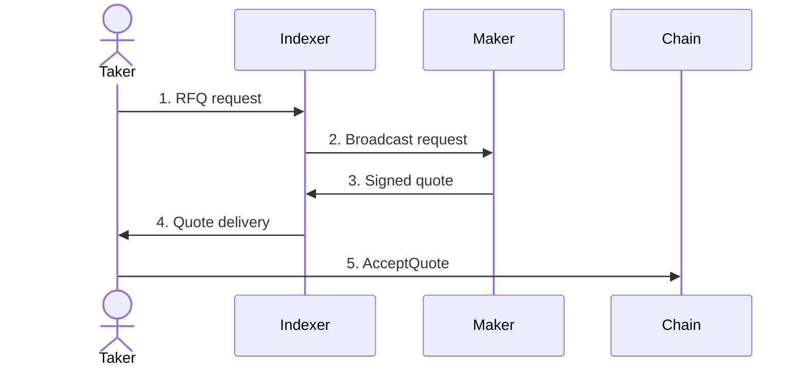

Request for Quote (RFQ) is a trading model where you request executable prices from liquidity providers before committing to a trade. On TrueCurrent, those prices are signed by makers, delivered through an indexer, and settled onchain only if they match your trade parameters.

The important distinction is simple:

- **Price discovery happens offchain** through a short maker competition.
- **Settlement happens onchain** through the TrueCurrent RFQ contract and Injective exchange module.

---

## The five-message cycle

As a trader, you receive quotes and settle the one you accept. As a maker, you do not submit a transaction per trade; you sign prices offchain and the contract verifies them if a taker accepts.

---

## RFQ vs. AMM

Automated Market Makers price trades from pool balances and a formula such as `x * y = k`. That is useful for passive spot liquidity, but it creates tradeoffs:

- Every trade moves the pool price.
- Large trades pay progressively worse execution.
- Public pending transactions can expose traders to MEV.
- The pool cannot react to external markets except through arbitrage.

TrueCurrent's RFQ model asks professional makers to quote each request using current market data, inventory, volatility, funding, and order size. The quote is firm for its short expiry window. If it settles, the contract enforces the signed price.

---

## RFQ vs. order books

An order book matches against passive resting liquidity. RFQ is active liquidity:

| Order book | RFQ |
| --- | --- |
| You consume resting bids or asks | Makers respond to your specific request |
| Large orders can walk the book | Makers can quote one executable size-aware price |
| Price is visible before execution | Maker quotes are signed and routed for your settlement flow |
| Liquidity is passive | Liquidity providers actively compete |

TrueCurrent still settles through Injective's exchange module, but the public execution flow is RFQ-only: a trade fills from signed maker quotes, not from a different hidden price path.

---

## How makers price

When a maker receives your RFQ request, it typically considers:

1. Current mark price and external reference markets
2. Market volatility and quote expiry
3. Requested margin, quantity, and `worst_price`
4. Inventory skew and hedge cost
5. Funding carry
6. Available margin and per-market risk limits
7. Competition from other makers

The maker can decline by not quoting. If no maker returns an acceptable quote, no trade settles and you can request again with fresh market data.

---

## Quote expiry

Live quotes are intentionally short-lived, commonly around two seconds. That protects makers from stale-price exposure and keeps spreads tighter for traders.

The contract checks expiry at settlement time. If a quote expires before the transaction lands, that quote is skipped. If every submitted quote is skipped or invalid, settlement fails with no fill.

---

## Why signed quotes matter

Signed quotes bind the maker to exact terms:

- Market
- RFQ ID
- Taker address and direction
- Maker address and subaccount nonce
- Margin and quantity
- Price
- Expiry
- Minimum fill quantity
- EIP-712 domain for the chain and RFQ contract

The indexer cannot change those terms. The taker cannot settle a worse price than their `worst_price`. The maker cannot be filled at a price it did not sign.

For the technical sequence, see [How RFQ works](/technical/how-rfq-works).
