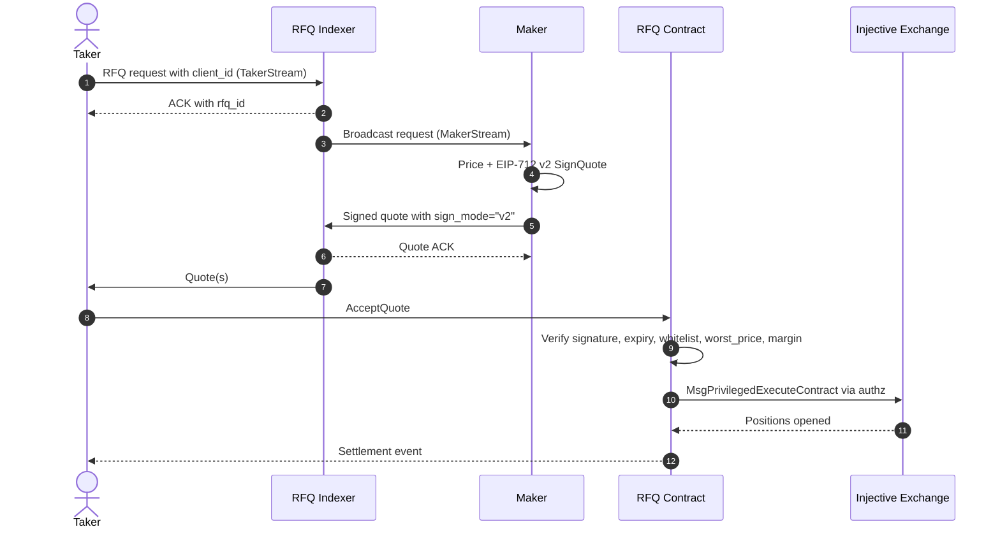

TrueCurrent splits RFQ trading into two planes:

| Plane | Components | What happens there |
| --- | --- | --- |
| **Offchain coordination** | TakerStream, MakerStream, RFQ indexer | Request routing, maker competition, quote delivery, maker auth challenges, quote ACKs |
| **Onchain settlement** | RFQ contract, Injective exchange module, authz grants | Signature verification, quote validation, margin movement, derivative position creation, liquidation eligibility |

This split is the trust model. The indexer coordinates. The contract decides what can settle.

---

## Signal flow

The maker never broadcasts the taker's `AcceptQuote` transaction. A successful maker `quote_ack` means the indexer accepted and routed the quote; it does not mean the taker accepted it or that settlement succeeded.

---

## Components

### TakerStream

TakerStream is the bidirectional stream used by takers to submit RFQ requests and collect quotes. Taker integrations must treat the ACK-returned `rfq_id` as the source of truth. A locally generated timestamp or UUID is only a `client_id`; it is not the settlement `rfq_id`.

### MakerStream

MakerStream is the bidirectional stream used by makers to receive RFQ requests and send quotes. It uses gRPC-web framing over WebSocket and requires an application-level ping roughly every second.

Before any request events arrive, the indexer sends a one-shot `MakerChallenge`. Makers sign `StreamAuthChallenge` with EIP-712 v2 and reply with `MakerAuth`. The reference `MakerStreamClient` handles this when configured with `auth_private_key`, `auth_evm_chain_id`, and `auth_contract_address`.

### RFQ indexer

The indexer maintains stream connections, broadcasts requests, collects maker quotes, and routes quotes back to the taker. It also validates message shape before forwarding. It cannot change signed quote terms or force onchain settlement.

### RFQ contract

The contract verifies every quote submitted to `AcceptQuote`. It checks maker registration, signature recovery, expiry, `worst_price`, quote bands, margin availability, and fill constraints. Invalid quotes are skipped; if no quote fills, settlement fails.

### Injective exchange module

The RFQ contract settles through Injective's native exchange module using pre-granted `authz` permissions. This is where margin accounting, positions, funding, liquidation, and ADL live.

---

## Settlement paths

### `AcceptQuote`

This is the normal synchronous path. The taker is online, receives quotes, chooses quote(s), and submits the transaction. Makers only sign quotes offchain.

### `AcceptSignedIntent`

This is the conditional TP/SL path. The taker pre-signs a reduce-only intent, submits it to the indexer, and a relayer submits settlement when the mark-price trigger is satisfied. Makers can participate by responding live when the relayer fires an RFQ or by pre-posting blind quotes. Participation is optional.

---

## Operational invariant

If you remember one thing from the architecture, make it this:

> Indexer success is not settlement success.

Log both layers separately:

- Stream-level events: request received, quote sent, quote ACK, stream errors, reconnects
- Contract-level events: transaction hash, filled quantity, skipped quote reasons, position state

Most integration bugs are caused by confusing those layers.
