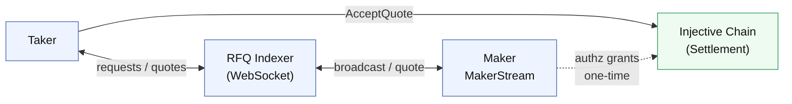

### How it works

1. **Taker** sends an RFQ request via the **TakerStream** WebSocket.
2. **RFQ Indexer** broadcasts the request to all connected **Makers** via **MakerStream**.
3. **Makers** price, sign, and return a quote over MakerStream.
4. **Indexer** relays quotes back to the taker after a collection window.
5. **Taker** picks one or more quotes and calls `AcceptQuote` on the RFQ contract.
6. **Contract** verifies each maker signature and settles the trade atomically through Injective.

As a MM, you only:

- Connect to MakerStream
- Receive requests
- Sign and send quotes

You do **not** submit an onchain transaction for each trade. The taker submits settlement, and the contract enforces your signed quote cryptographically.

> **TP/SL note:** `AcceptSignedIntent` is the settlement path for take-profit and stop-loss exits. A relayer submits the trade on the taker's behalf when a mark-price trigger fires. From your side as a maker, you can supply either:
>
> - **Blind quotes** (pre-posted, nonce-based) — the relayer picks from your pre-posted book when a trigger fires.
> - **Taker-specific quotes** (live RFQ response) — the relayer fires off a live RFQ at trigger time and you quote it the usual way.
>
> The wire-level signing and quote shape are identical in both paths. See [TP/SL liquidity](/sdk-trading/tpsl-liquidity).
