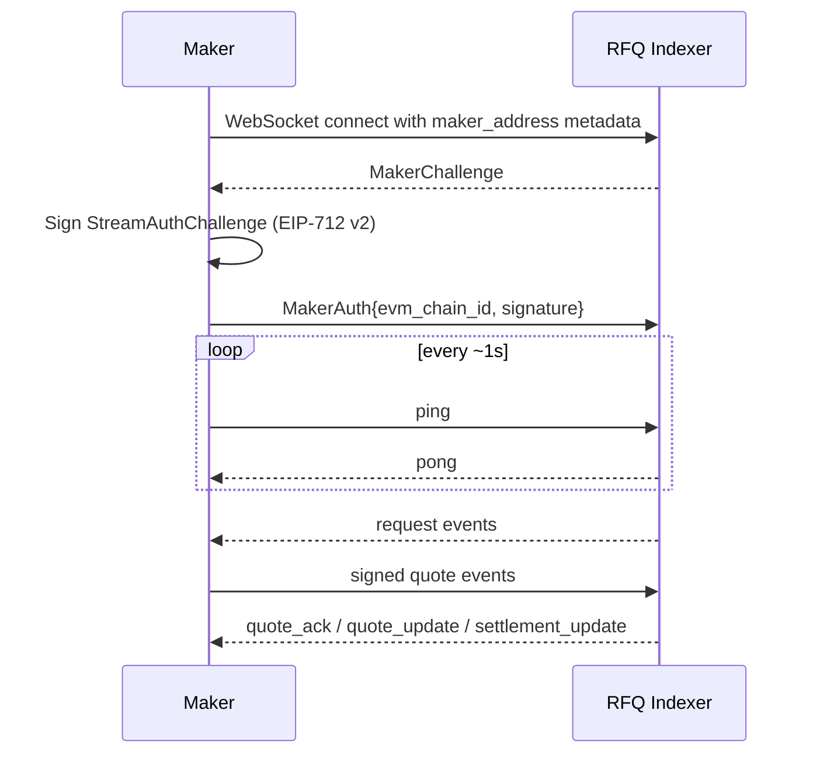

MakerStream is the bidirectional stream used by whitelisted makers. You receive RFQ requests and send signed quotes on the same connection.

The connection is gRPC-web over WebSocket with protobuf payloads. Most integrations should use `MakerStreamClient` from `injective-rfq-toolkit` rather than hand-rolling framing.

---

## Endpoint

| Environment | MakerStream URL |
| --- | --- |
| Testnet | `wss://testnet.rfq.ws.injective.network/injective_rfq_rpc.InjectiveRfqRPC/MakerStream` |
| Mainnet | Contact TrueCurrent for the current production endpoint |

Connection details:

| Property | Value |
| --- | --- |
| Protocol | gRPC-web over WebSocket |
| WebSocket subprotocol | `grpc-ws` |
| Serialization | Protobuf |
| Framing | `[1 byte flags][4 bytes length BE][protobuf payload]` |
| Keep-alive | Send ping roughly every second |
| Service | `injective_rfq_rpc.InjectiveRfqRPC` |
| Method | `MakerStream` |

<Info>
The indexer's internal proto may use different package or method names. Public traffic uses the `injective_rfq_rpc.InjectiveRfqRPC/MakerStream` alias. Use the public alias shown above.
</Info>

---

## Connection sequence



Until the auth challenge is answered successfully, the stream may remain open but no `request` events arrive.

---

## Message types

MakerStream responses are tagged by `message_type`.

| `message_type` | Direction | Meaning |
| --- | --- | --- |
| `challenge` | Indexer -> maker | One-shot `MakerChallenge`; must be answered before requests are streamed |
| `pong` | Indexer -> maker | Response to maker ping |
| `request` | Indexer -> maker | RFQ request broadcast |
| `quote_ack` | Indexer -> maker | Indexer accepted or rejected the submitted quote payload |
| `quote_update` | Indexer -> maker | Quote lifecycle update, when available |
| `settlement_update` | Indexer -> maker | Settlement attempt or fill update, when available |
| `error` | Indexer -> maker | Stream or payload error |

MakerStream requests you send are also tagged:

| `message_type` | Payload |
| --- | --- |
| `ping` | Heartbeat |
| `auth` | `MakerAuth` response to the challenge |
| `quote` | Signed RFQ quote |

---

## Auth handshake

The indexer challenges the maker address announced in connection metadata. Sign the challenge with the same EIP-712 domain family used for quotes:

| Domain field | Value |
| --- | --- |
| `name` | `"RFQ"` |
| `version` | `"1"` |
| `chainId` | EVM chain ID (`1439` testnet, `1776` mainnet) |
| `verifyingContract` | RFQ contract converted from bech32 to EVM address |

### `MakerChallenge`

| Field | Type | Meaning |
| --- | --- | --- |
| `nonce` | string | Hex-encoded 32 bytes. Decode to raw bytes for signing; do not hash the nonce first. |
| `evm_chain_id` | uint64 | Chain ID for the EIP-712 domain. |
| `expires_at` | sint64 | Unix milliseconds. Sign and reply before it expires. |

### `StreamAuthChallenge`

Type string:

```text
StreamAuthChallenge(uint64 evmChainId,address maker,bytes32 nonce,uint64 expiresAt)
```

| Field | Encoding |
| --- | --- |
| `evmChainId` | Big-endian integer word |
| `maker` | 20-byte EVM address derived from maker `inj1...` |
| `nonce` | Raw 32 bytes from `MakerChallenge.nonce` |
| `expiresAt` | Big-endian integer word |

### `MakerAuth`

Send the response as:

| Field | Meaning |
| --- | --- |
| `evm_chain_id` | Same value from the challenge |
| `signature` | `0x`-prefixed 65-byte secp256k1 signature (`r || s || v`, compact `v=0/1`) |

---

## Recommended client

`injective-rfq-toolkit` handles framing, pings, and MakerChallenge auth when configured with auth fields.

```python
from rfq_test.clients.websocket import MakerStreamClient

mm_ws = MakerStreamClient(
    endpoint=env.indexer.ws_endpoint,
    maker_address=mm_wallet.inj_address,
    subscribe_to_quotes_updates=True,
    subscribe_to_settlement_updates=True,
    auth_private_key=MM_PRIVATE_KEY,
    auth_evm_chain_id=1439,
    auth_contract_address=env.contract.address,
    timeout=15.0,
)

await mm_ws.connect()
```

If the stream connects and pongs return, but no `request` events arrive, debug the auth challenge first: wrong `evm_chain_id`, wrong contract domain, stale challenge, or a signature over hashed nonce bytes instead of raw nonce bytes are common causes.

---

## Implementation checklist

- Use the `grpc-ws` WebSocket subprotocol.
- Send `maker_address` metadata on connect.
- Answer `MakerChallenge` before expecting requests.
- Start pinging immediately and continue roughly every second.
- Treat `rfq_id` from each request as the correlation key.
- Log every `quote_ack`, `quote_update`, `settlement_update`, and `error`.
- Reconnect with backoff and re-authenticate after reconnecting.

Next: [RFQ requests](/sdk-trading/rfq-requests) and [Sending quotes](/sdk-trading/sending-quotes).
