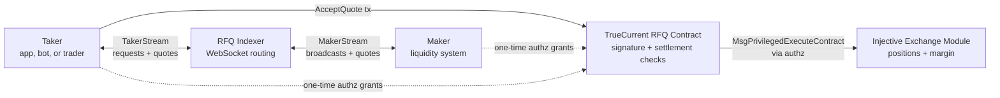

TrueCurrent's SDK path gives teams programmatic access to the same RFQ execution model used by the web app. It is for two roles:

| Role | What you do | Typical use |
| --- | --- | --- |
| **Taker** | Submit trade requests, collect signed maker quotes, choose the best executable quote, and settle onchain | Trading bots, execution desks, vaults, wallets, and apps embedding TrueCurrent |
| **Maker** | Connect to MakerStream, receive RFQ requests, price each request, sign quotes, and manage inventory | Professional liquidity providers and market-making systems |

Most integrations are takers. Makers must be approved before the indexer routes requests to them and before the contract accepts their quotes.

---

## The core model

The RFQ system is an offchain quoting network with onchain settlement.

As a maker, your hot path is only: connect, receive, sign, send. You do not submit an onchain transaction for every trade. The taker submits `AcceptQuote`, and the contract enforces your signed quote cryptographically.

As a taker, your hot path is: request, collect, select, settle. The indexer helps you discover quotes, but the settlement transaction is still checked onchain.

---

## Standard trade lifecycle

1. The taker submits an RFQ request through TakerStream with market, direction, margin, quantity, `worst_price`, and a UUID `client_id`.
2. The indexer acknowledges the request and assigns the real `rfq_id`.
3. The indexer broadcasts the request to connected, whitelisted makers through MakerStream.
4. Makers price the request, sign an EIP-712 v2 `SignQuote` digest, and return quotes with `sign_mode: "v2"` and `evm_chain_id`.
5. The taker collects quotes, chooses one or more executable quotes, and submits `AcceptQuote`.
6. The RFQ contract verifies signatures, quote expiry, maker whitelist status, taker `worst_price`, quote bands, available margin, and fill constraints.
7. The contract opens both sides atomically through Injective's exchange module.

The indexer routes messages. The contract enforces settlement. If the indexer drops a request, service degrades; it cannot forge a maker signature, change a signed price, or settle a trade that fails contract checks.

---

## Two settlement paths

| Path | Who submits the tx | When it is used | Read next |
| --- | --- | --- | --- |
| `AcceptQuote` | Taker | Normal synchronous RFQ trades while the taker is online | [Taker SDK trading](/sdk-trading/takers), [Maker SDK trading](/sdk-trading/makers) |
| `AcceptSignedIntent` | Executor | TP/SL exits where the taker pre-signs a conditional order | [Signed intents](/sdk-trading/signed-intents) |

Both paths end in the same kind of onchain settlement. The difference is who authorizes and submits the settlement: a live taker transaction for `AcceptQuote`, or a pre-signed taker intent submitted by the executor for `AcceptSignedIntent`. Makers still receive ordinary RFQ requests and sign ordinary quotes.

---

## What the SDK abstracts

For takers, the reference client covers:

- TakerStream connection and gRPC-web framing
- RFQ request creation and ACK handling
- ACK-returned `rfq_id` correlation
- Quote collection and filtering
- `AcceptQuote` construction and broadcast
- Signed-intent creation and cancellation helpers

For makers, the reference client covers:

- MakerStream connection and ping cadence
- Maker auth challenge response
- RFQ request decoding
- EIP-712 v2 quote signing helpers
- Required wire fields such as `sign_mode` and `evm_chain_id`
- Quote submission, quote ACKs, and settlement updates

Your system still owns strategy, pricing, risk limits, balance monitoring, key management, and operational recovery.

---

## Integration order

<CardGroup cols={2}>
  <Card title="Taker path" icon="code" href="/sdk-trading/takers">
    Build request, quote collection, settlement, and TP/SL intent flows.
  </Card>

  <Card title="Maker path" icon="chart-candlestick" href="/sdk-trading/makers">
    Build whitelist setup, MakerStream auth, quote signing, inventory, and settlement monitoring.
  </Card>

  <Card title="Authz setup" icon="key" href="/sdk-trading/authz">
    Grant the RFQ contract the narrow settlement permissions required by each role.
  </Card>

  <Card title="Run testnet E2E" icon="terminal" href="/sdk-trading/runbook">
    Validate config, balances, grants, MakerStream auth, `AcceptQuote`, and signed intents.
  </Card>
</CardGroup>

For the lower-level sequence and validation rules, see [SDK architecture](/sdk-trading/architecture) and [How RFQ works](/technical/how-rfq-works).
