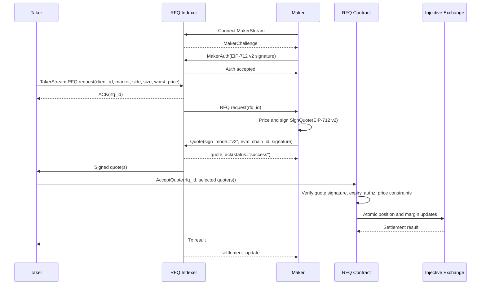
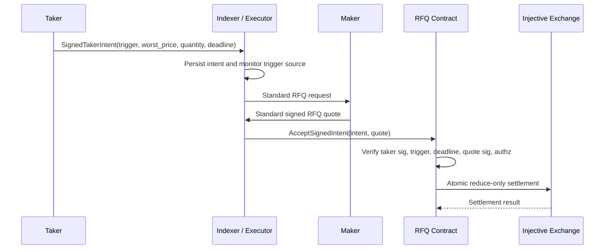

This page is the compact protocol reference. Read it when you need to debug a message flow, map SDK fields to onchain settlement, or confirm which identifier belongs in which part of the RFQ stack.

For conceptual background, start with [SDK architecture](/sdk-trading/architecture). For runnable commands, use the [Runbook](/sdk-trading/runbook).

---

## Actors

| Actor | Runs where | Responsibility | Trust boundary |
| --- | --- | --- | --- |
| Taker | Client or trading service | Requests quotes, selects quotes, submits settlement | Owns taker key and taker margin |
| Maker | Market-maker service | Receives RFQs, signs executable quotes, manages maker inventory | Owns maker key and maker margin |
| RFQ indexer / executor | TrueCurrent service | Routes requests and quotes, assigns `rfq_id`, monitors signed intents, emits ordinary RFQs when triggers fire | Cannot change signed fields or settle without valid signatures |
| RFQ contract | Injective CosmWasm | Verifies signatures, authz, expiries, constraints, then settles | Onchain enforcement point |
| Injective exchange module | Injective chain | Opens, closes, and liquidates derivative positions | Final position and margin ledger |

---

## Live RFQ path (`AcceptQuote`)

`quote_ack.status="success"` means the indexer accepted and routed a syntactically valid quote. It is not a fill signal. The fill signal is either the onchain transaction result observed by the taker or the maker-side `settlement_update`.

---

## Signed-intent path (`AcceptSignedIntent`)

TP/SL orders are pre-signed taker intents. The taker can go offline after submission; the executor fires the exit when the trigger condition is satisfied.

Makers do not need to distinguish this from any other RFQ request. The TP/SL-specific state is owned by the taker and executor. For taker-side fields and signing, see [Signed intents](/sdk-trading/signed-intents).

---

## Settlement checks

The contract processes submitted quotes and skips quotes that fail quote-level validation. Settlement succeeds only if the selected valid quotes satisfy the taker's fill constraints.

| Check | Failure result |
| --- | --- |
| Maker signature verifies against the exact submitted fields | Quote skipped |
| Quote `sign_mode` is `v2` and `evm_chain_id` matches the EIP-712 domain | Quote skipped |
| Quote `rfq_id` matches the request or signed intent | Quote skipped or `rfq_id mismatch` |
| Quote has not expired at settlement block time | Quote skipped |
| Maker is whitelisted and uses the registered `maker_subaccount_nonce` | Quote skipped or no fill |
| Maker and taker authz grants exist for the RFQ contract | Transaction fails with authorization error |
| Maker and taker subaccounts have enough margin | Quote skipped or transaction fails |
| Price satisfies taker `worst_price` and mark-band checks | Quote skipped |
| Min-fill and unfilled-action rules are satisfied | Partial fill or no fill |
| Signed-intent trigger, `deadline_ms`, `epoch`, and `lane_version` are valid | `AcceptSignedIntent` fails |

---

## Identifier reference

| Field | Assigned by | Used in | Notes |
| --- | --- | --- | --- |
| `client_id` | Taker | TakerStream request only | UUID correlation key for the client. It is not signed and is not the settlement nonce. |
| `rfq_id` | Indexer | Request ACK, maker request, quote signature, settlement | Use the ACK-returned value. Do not invent it locally. |
| `chain_id` | Environment config | Quote wire payload | Cosmos chain ID: `injective-888` on testnet, `injective-1` on mainnet. |
| `evm_chain_id` | Environment config | EIP-712 domain and v2 wire fields | `1439` on testnet, `1776` on mainnet. Do not put this value in `quote.chain_id`. |
| `contract_address` | Environment config | Quote wire payload and EIP-712 domain | Bech32 RFQ contract address on the wire; converted to EVM address inside the typed-data domain. |
| `maker_subaccount_nonce` | Maker registration | Quote signature and settlement | If `list_makers` returns `null`, quote with nonce `0`. |
| `expiry` | Maker | Quote signature and settlement | Milliseconds. Live quotes must be at least `now_ms + 1_500`; `now_ms + 2_000` or longer improves match odds but increases stale-price exposure. |
| `epoch` | Contract state | Signed intents | Bumped by `CancelAllIntents`; invalidates all older taker intents. |
| `lane_version` | Contract state | Signed intents | Bumped by `CancelIntentLane`; invalidates one `(taker, market_id, subaccount_nonce)` lane. |

---

## Testnet markets

| Market | Symbol | Market ID | Price tick |
| --- | --- | --- | --- |
| INJ/USDC PERP | `INJ/USDC PERP` | `0xdc70164d7120529c3cd84278c98df4151210c0447a65a2aab03459cf328de41e` | `0.01` |
| BTC/USDC PERP | `BTC/USDC PERP` | `0xfd704649cf3a516c0c145ab0111717c44640d8dbe52a462ae35cadf2f6df1515` | `1` |
| LINK/USDC PERP | `LINK/USDC PERP` | `0xdbb9bb072015238096f6e821ee9aab7affd741f8662a71acc14ac30ee6b687a5` | `0.001` |
| ETH/USDC PERP | `ETH/USDC PERP` | `0x135de28700392fb1c17d40d5170a74f30055a4ad522feddafec42fbbbb780897` | `0.1` |

<Warning>
For integer-tick markets such as BTC/USDC, canonicalize prices without a decimal point. `"76462"` is valid; `"76462.0"` can fail signature or tick validation depending on where it is introduced.
</Warning>

---

## Related implementation pages

- [Testnet configuration](/sdk-trading/testnet-configuration) lists endpoints, contract address, EVM chain IDs, and token denom.
- [Building and signing quotes](/sdk-trading/signing-quotes) documents the exact EIP-712 v2 `SignQuote` field order.
- [Sending quotes](/sdk-trading/sending-quotes) explains MakerStream quote payloads and ACK semantics.
- [Troubleshooting](/sdk-trading/troubleshooting) maps common errors to fixes.
