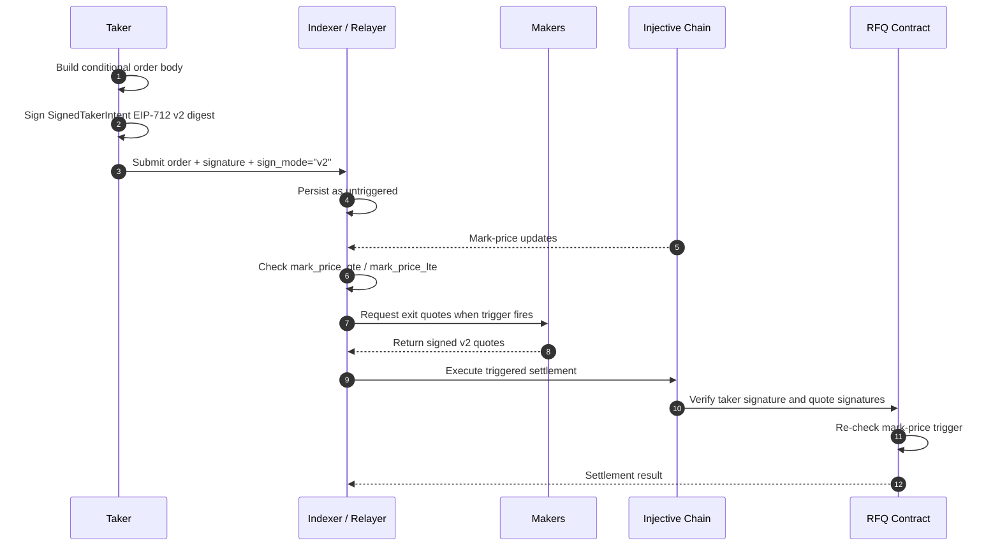

A **signed taker intent** is a pre-authorized conditional order. You sign the exit parameters ahead of time, submit them to the indexer, and the relayer settles the trade when the mark-price trigger is satisfied.

This is how **take-profit / stop-loss** orders work on TrueCurrent. You can create the signed exit when opening a position or later, while the position is already open.

<Warning>
Current trigger orders are reduce-only close-position orders. Set `margin` to `"0"` and use `sign_mode: "v2"` on the wire. Do not use JSON-string signing for conditional orders.
</Warning>

---

## When to use signed intents

Use a signed intent when you cannot be online to submit at the exact trigger moment, but you can decide the trigger and exit constraints in advance.

- **Take profit:** exit long when mark price is greater than or equal to target, or exit short when mark price is less than or equal to target.
- **Stop loss:** exit long when mark price is less than or equal to stop, or exit short when mark price is greater than or equal to stop.

If you want to trade immediately while online, use [`AcceptQuote`](/sdk-trading/accepting-quotes).

---

## End-to-end flow



The trigger is not latched. If the mark price moves back before the transaction lands, the contract can reject the settlement as `trigger_not_satisfied`.

---

## Conditional order body

These fields are sent to the indexer and contract. The v2 signature covers the `SignedTakerIntent` typed-data fields; `chain_id`, `contract_address`, `evm_chain_id`, and `unfilled_action` are wire/runtime fields.

| Field | Type | Description |
|---|---|---|
| `version` | `uint8` | Use `1`. This is the intent schema version, not the signing mode. |
| `chain_id` | `string` | Cosmos chain ID, for example `"injective-888"` on testnet. Wire/runtime field. |
| `contract_address` | `string` | RFQ contract address. Wire/runtime field; the signature binds the contract via the EIP-712 domain. |
| `taker` | `string` | Taker `inj1...` address. |
| `epoch` | `uint64` | Current taker epoch. Incremented by global intent cancellation. |
| `rfq_id` | `uint64` | Unique order ID. Use a fresh timestamp or generated ID. |
| `market_id` | `string` | Injective derivative market ID. |
| `subaccount_nonce` | `uint32` | Subaccount index, usually `0`. |
| `lane_version` | `uint64` | Current `(taker, market, subaccount)` lane version. Incremented by lane cancellation and successful settlement. |
| `deadline_ms` | `uint64` | Unix millisecond deadline. Max 30 days from signing. |
| `direction` | `"long" \| "short"` | Exit trade direction (a closing trade is the *opposite* direction of the position you're exiting). |
| `quantity` | `string` | Quantity to close, as a canonical decimal string. |
| `margin` | `string` | Use `"0"` for reduce-only trigger orders. |
| `worst_price` | `string` | Worst acceptable quoted fill price. |
| `min_total_fill_quantity` | `string` | Minimum aggregate fill quantity required for settlement. |
| `trigger_type` | `string` | `"mark_price_gte"`, `"mark_price_lte"`, or `"immediate"`. |
| `trigger_price` | `string \| null` | Trigger threshold. Use `"0"` or `null` for `immediate`, depending on the helper path. |
| `unfilled_action` | `null` | Reserved field; pass `null`. Non-null values are not exposed in the current product. |
| `cid` | `string \| null` | Optional client identifier. Bound by the v2 signature. |
| `allowed_relayer` | `string \| null` | Optional relayer address. Bound by the v2 signature when set. |
| `evm_chain_id` | `uint64` | Wire field included in the order body; matches the EIP-712 domain `chainId` (`1439` testnet, `1776` mainnet). |

---

## EIP-712 domain

Signed intents use the same domain separator as maker quotes:

| Field | Value |
|---|---|
| `name` | `"RFQ"` |
| `version` | `"1"` |
| `chainId` testnet | `1439` |
| `chainId` mainnet | `1776` |
| `verifyingContract` | EVM form of the RFQ contract address |

The domain `chainId` is the EVM chain ID, not the Cosmos chain ID.

---

## Sign and submit a conditional order

Use `sign_conditional_order_v2` from `rfq-testing` to produce the EIP-712 v2 digest signature, then submit via `TakerStreamClient.send_conditional_order`. The helper returns a `0x`-prefixed 65-byte signature; pass it through unchanged.

```python
import os
import time
from rfq_test.crypto.wallet import Wallet
from rfq_test.crypto.eip712     import sign_conditional_order_v2
from rfq_test.clients.websocket import TakerStreamClient

taker = Wallet.from_private_key(os.environ["TESTNET_RETAIL_PRIVATE_KEY"])
rfq_id      = int(time.time() * 1000)
deadline_ms = rfq_id + 86_400_000          # 24h, max 30d

intent_sig = sign_conditional_order_v2(
    private_key=taker.private_key,
    evm_chain_id=evm_chain_id,             # 1439 testnet, 1776 mainnet
    verifying_contract_bech32=contract_address,
    version=1, taker=taker.inj_address,
    epoch=1, lane_version=1, subaccount_nonce=0,
    rfq_id=rfq_id, market_id=MARKET.id, deadline_ms=deadline_ms,
    direction="short",                     # closing a long
    quantity="1", margin="0",              # margin="0" = reduce-only
    worst_price="19.5",                    # worst acceptable fill
    min_total_fill_quantity="1",
    trigger_type="mark_price_gte",         # take-profit on a long
    trigger_price="20.0",
)

# TakerStream wraps the order body in conditional_order_sign_mode="v2" +
# conditional_order_evm_chain_id when you pass sign_mode + evm_chain_id below.
async with TakerStreamClient(
    env.indexer.ws_endpoint,
    request_address=taker.inj_address,
) as client:
    ack = await client.send_conditional_order(
        order_body={
            "version": 1, "chain_id": chain_id, "contract_address": contract_address,
            "taker": taker.inj_address, "epoch": 1, "rfq_id": rfq_id,
            "market_id": MARKET.id, "subaccount_nonce": 0, "lane_version": 1,
            "deadline_ms": deadline_ms, "direction": "short",
            "quantity": "1", "margin": "0", "worst_price": "19.5",
            "min_total_fill_quantity": "1",
            "trigger_type": "mark_price_gte", "trigger_price": "20.0",
            "unfilled_action": None, "cid": None, "allowed_relayer": None,
            "evm_chain_id": evm_chain_id,
        },
        signature=intent_sig,
        sign_mode="v2",
        evm_chain_id=evm_chain_id,
        wait_for_ack=True,
    )

print(f"SI ACK: rfq_id={ack['rfq_id']} status={ack['status']}")
```

The signed values you pass to `sign_conditional_order_v2` and the values in the `order_body` you submit must match exactly. Any drift (different price string, different `lane_version`) will fail signature recovery at the indexer or contract.

For REST submissions, include the same signing mode explicitly:

```python
await http.post(
    f"{indexer_http_endpoint}/v1/conditionalOrder",
    json={
        "order": order_body,
        "signature": intent_sig,
        "sign_mode": "v2",
    },
)
```

---

## Trigger types

```json
{ "trigger_type": "immediate", "trigger_price": "0" }
{ "trigger_type": "mark_price_gte", "trigger_price": "5.20" }
{ "trigger_type": "mark_price_lte", "trigger_price": "4.80" }
```

Mapping trigger to intent (the `direction` field is the *closing* direction, opposite to the open position):

| Closing | Goal | `trigger_type` | When mark price |
|---|---|---|---|
| Long position | Take profit | `mark_price_gte` | rises to or above target |
| Long position | Stop loss | `mark_price_lte` | falls to or below stop |
| Short position | Take profit | `mark_price_lte` | falls to or below target |
| Short position | Stop loss | `mark_price_gte` | rises to or above stop |

The contract re-evaluates the mark-price trigger during settlement. If mark moves back before the relayer's transaction lands, the contract rejects with `trigger_not_satisfied` — the relayer should wait and retry when the trigger is satisfied again.

---

## Epochs and lanes

Before signing, read the current `epoch` and `lane_version` for the taker. A signed intent is valid only for the exact values it signs.

- `CancelAllIntents` increments the taker's epoch and invalidates every outstanding intent for that taker.
- `CancelIntentLane` increments the lane version for one `(taker, market_id, subaccount_nonce)` lane.
- Successful settlement also advances the lane version, making trigger intents one-shot by construction.

```python
from rfq_test.clients.contract import ContractClient
contract = ContractClient(env.contract, env.chain)

# Cancel everything in this market lane
tx = await contract.cancel_intent_lane(
    private_key=RETAIL_PK,
    market_id=MARKET.id, subaccount_nonce=0,
)

# Cancel everything across all markets for this taker
tx = await contract.cancel_all_intents(private_key=RETAIL_PK)
```

---

## Common failures

| Symptom | Fix |
|---|---|
| Missing conditional order signing mode | Send `sign_mode: "v2"` on REST or let `send_conditional_order` set it on TakerStream. |
| Invalid signature | Check EVM `chainId`, verifying contract, exact decimal strings, trigger fields, `epoch`, and `lane_version`. |
| Trigger not satisfied | The mark price moved back before settlement. The relayer should retry when the trigger is satisfied again. |
| Stale lane or epoch | Refresh state from the contract and sign a new intent. |

---

## Next

- [Accepting quotes](/sdk-trading/accepting-quotes) covers the synchronous `AcceptQuote` path.
- [Trigger orders](/trading/trigger-orders) explains TP/SL behavior at the product level.
- [Best practices](/sdk-trading/taker-best-practices) covers expiry races, idempotency, and `cid` usage.
