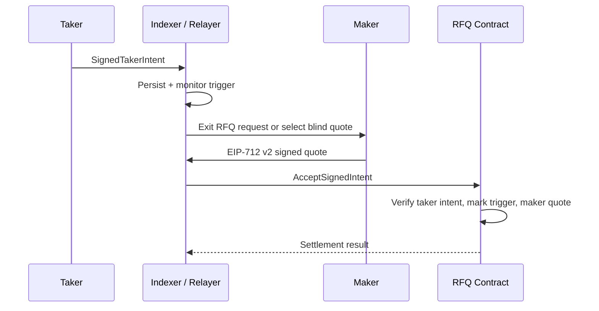

Take-profit and stop-loss orders are submitted as signed taker intents. The taker pre-signs a reduce-only exit, the indexer monitors the mark-price trigger, and a relayer submits `AcceptSignedIntent` when the trigger is satisfied.

Makers provide the closing liquidity through the same signed quote primitive used by live RFQs.

---

## Settlement path

The contract re-checks the trigger at execution time. If mark price moves back before the relayer transaction lands, settlement can fail with `trigger_not_satisfied`.

---

## Three maker participation modes

### 1. Live response on trigger

Stay connected to MakerStream. When a trigger fires, the relayer sends a standard exit RFQ request. You price it, sign it with `sign_quote_v2`, and send it with `sign_mode: "v2"` and `evm_chain_id`.

From the maker's perspective, this is the same as a normal live RFQ. The taker direction is still the direction being traded by the taker, and your exposure is the opposite side.

### 2. Pre-posted blind quotes

Blind quotes are nonce-based maker quotes that are not bound to a specific live taker request. They let a relayer source liquidity for TP/SL execution without waiting for the maker to be online at the exact trigger moment.

| Field | Live taker-bound quote | Blind quote |
| --- | --- | --- |
| `taker` | Taker `inj1...` address | Empty / unset or zero-address helper path |
| `rfq_id` | Indexer-assigned request ID | Maker-controlled quote nonce / matching identifier |
| `bindingKind` in digest | `1` | `0` |
| Expiry | Very short | Longer, maker-controlled |
| Operational burden | Stream uptime | Nonce, inventory, expiry, and cancel management |

Use blind quotes only after the live RFQ path works. A nonce that has settled cannot be reused, and stale blind quotes should be cancelled or allowed to expire.

### 3. Do nothing

TP/SL participation is optional. If another maker has acceptable blind-quote coverage, or if the relayer sources liquidity elsewhere, the protocol can settle without your system. Not responding to a TP/SL event carries no direct reputational cost.

---

## Current scope

Current TP/SL signed intents are protective close-position orders:

- `margin` should be `"0"` for reduce-only settlement.
- `unfilled_action` is reserved and should be `null`.
- The relayer submits only when the mark-price trigger is satisfied.
- The maker quote still uses EIP-712 v2 `SignQuote`.

General blind-book market making is a separate future workflow.

---

## Failure modes

| Error | Meaning |
| --- | --- |
| `invalid_intent_signature` | The taker signed a different intent body, chain domain, contract, decimal string, epoch, or lane version |
| `stale epoch` | `CancelAllIntents` invalidated the taker's outstanding intents |
| `stale lane` | `CancelIntentLane` or successful settlement advanced the `(taker, market, subaccount)` lane |
| `trigger_not_satisfied` | The relayer submitted before the mark-price condition was true at execution time |
| `quote_rfq_id mismatch` | The maker quote does not match the `rfq_id` embedded in the signed intent |
| Quote skipped | Same causes as live RFQ: expiry, signature mismatch, `worst_price`, mark-band validation, margin, or min-fill constraints |

These errors are protocol-level. Retrying without refreshing state often repeats the same failure.

---

## Cancelling signed intents

Two onchain cancel paths bump counters that invalidate older signatures:

- `CancelIntentLane`: Invalidates intents for one `(taker, market_id, subaccount_nonce)` lane. Future intents must use the next `lane_version`.
- `CancelAllIntents`: Invalidates all intents for the taker. Future intents must use the next `epoch`.

Makers do not cancel taker intents. Makers cancel or expire their own blind quotes when their price, inventory, or risk assumptions change.

---

## Read next

- [Signed taker intents](/sdk-trading/signed-intents) for taker-side signing and submission.
- [Building & signing quotes](/sdk-trading/signing-quotes) for the maker quote digest.
- [Testnet runbook](/sdk-trading/runbook) for an executable signed-intent test.
