`AcceptQuote` is the onchain entrypoint that settles an RFQ trade. As a taker, it's the only contract message you call. This page documents every field, every encoding rule, and every validation the contract performs – including the features that aren't obvious from the other docs.

---

## Message shape

```json
{
  "accept_quote": {
    "rfq_id": 1708000700000,
    "market_id": "0xdc70164d7120529c3cd84278c98df4151210c0447a65a2aab03459cf328de41e",
    "direction": "long",
    "margin": "200",
    "quantity": "100",
    "worst_price": "5.00",
    "quotes": [
      {
        "maker": "inj1maker...",
        "margin": "200",
        "quantity": "100",
        "price": "4.95",
        "expiry": { "ts": 1708000800000 },
        "signature": "Kg8z...base64..."
      }
    ],
    "unfilled_action": { "market": {} }
  }
}
```

This JSON is the payload of a standard `MsgExecuteContract` transaction to the TrueCurrent contract address, signed by the taker's private key.

---

## Three encoding rules you must follow

These encoding rules are relatively common to get wrong. However, they are strictly enforced, as the contract parses the message with strict Rust `serde` types.

### 1. `rfq_id` is a JSON number, not a string

The contract field is `u64`. JSON encoders that stringify large integers will produce bytes the contract rejects with a deserialization error.

```json
"rfq_id": 1708000700000     // ✅ correct
"rfq_id": "1708000700000"   // ❌ will fail to parse
```

In TypeScript, `Date.now()` returns a number – use it directly. In Python, cast `int(rfq_id)` before serializing; if you build the request from a string, convert first.

### 2. Quote `expiry` must be wrapped as `{"ts": <ms>}`

The contract's `Expiry` type is an enum with two variants – timestamp or block height. Serde requires the variant tag:

```json
"expiry": { "ts": 1708000800000 }   // ✅ timestamp variant (Unix ms)
"expiry": { "h": 19500000 }          // ✅ block height variant (rarely used)
"expiry": 1708000800000              // ❌ raw int is not a valid Expiry
```

The indexer delivers `expiry` as a plain integer. You must wrap it before passing to the contract.

### 3. Quote `signature` is base64, not hex

Indexers (including TrueCurrent's) transmit signatures as hex strings (`"0xabc123..."`). The contract's `signature` field is a CosmWasm `Binary` type, which on the wire is **standard `base64`**. You must convert.

**Python:**

```python
import base64

sig_hex = quote["signature"]
if sig_hex.startswith("0x"):
    sig_hex = sig_hex[2:]
signature_b64 = base64.b64encode(bytes.fromhex(sig_hex)).decode("utf-8")
```

**TypeScript:**

```ts
const sigHex = quote.signature.replace(/^0x/, "");
const signatureB64 = Buffer.from(sigHex, "hex").toString("base64");
```

If you skip the conversion, the contract returns a signature verification error that looks like the *maker* signed badly. However the true cause of the error is *encoding*.

The `ContractClient.accept_quote()` helper in `rfq-testing` handles all three of these automatically. If you're building from scratch, apply them yourself.

---

## Field reference

**Top-level fields:**

| Field | Type | Required | Description |
|---|---|---|---|
| `rfq_id` | number (u64) | yes | Must match the `rfq_id` on the request you sent to the indexer. Used as a nonce to prevent replay. |
| `market_id` | string | yes | Injective derivative market hex ID |
| `direction` | string | yes | `"long"` or `"short"` – lowercase. This is the taker's direction. |
| `margin` | string | yes | Taker margin in USDC, decimal string |
| `quantity` | string | yes | Requested quantity |
| `worst_price` | string | yes | Hard price limit. Individual quotes worse than this are rejected. |
| `quotes` | array | yes | One or more maker quotes to consume. Can be empty only if you're going pure orderbook. |
| `unfilled_action` | object \| null | no | What to do with any residual quantity. See below. |
| `subaccount_nonce` | number \| null | no | Subaccount index for the taker. Defaults to 0. |
| `cid` | string \| null | no | Client identifier echoed in the settlement event, for your own tracking. |

**Per-quote fields:**

| Field | Type | Required | Description |
|---|---|---|---|
| `maker` | string | yes | Maker's `inj1...` address |
| `margin` | string | yes | Maker's margin commitment |
| `quantity` | string | yes | Quantity the maker is offering |
| `price` | string | yes | Maker's quoted price |
| `expiry` | `{ts: number}` or `{h: number}` | yes | Quote expiry – wrapped enum |
| `signature` | string (base64) | yes | Maker's signature over the canonical quote payload |
| `nonce` | number \| null | no | Present on blind quotes, used for replay protection |
| `min_fill_quantity` | string \| null | no | Maker-imposed minimum fill; if the contract would fill them for less, the quote is skipped |

---

## Single-quote settlement

The simplest case: you collect quotes, pick one, accept it.

**Python** – high-level helper:

```python
from rfq_test.clients.contract import ContractClient
from rfq_test.models.types import Direction
from decimal import Decimal

contract = ContractClient(config.contract, config.chain)

tx_hash = await contract.accept_quote(
    private_key=TAKER_PRIVATE_KEY,
    quotes=[{
        "maker": best["maker"],
        "margin": "200",
        "quantity": "100",
        "price": best["price"],
        "expiry": best["expiry"],            # int ms – client wraps {"ts": ...}
        "signature": best["signature"],      # hex – client converts to base64
    }],
    rfq_id=str(rfq_id),
    market_id=MARKET_ID,
    direction=Direction.LONG,
    margin=Decimal("200"),
    quantity=Decimal("100"),
    worst_price=Decimal("5.00"),
    unfilled_action=None,
)
```

**Python** – manual, no helper:

```python
import base64, json
from pyinjective.composer_v2 import Composer
from pyinjective.core.broadcaster import MsgBroadcasterWithPk

sig_hex = best["signature"].removeprefix("0x")
sig_b64 = base64.b64encode(bytes.fromhex(sig_hex)).decode()

msg = {
    "accept_quote": {
        "rfq_id": int(rfq_id),                       # number
        "market_id": MARKET_ID,
        "direction": "long",                         # lowercase
        "margin": "200",
        "quantity": "100",
        "worst_price": "5.00",
        "quotes": [{
            "maker": best["maker"],
            "margin": "200",
            "quantity": "100",
            "price": best["price"],
            "expiry": {"ts": int(best["expiry"])},   # wrapped
            "signature": sig_b64,                    # base64
        }],
        "unfilled_action": None,
    }
}

composer = Composer(network=network.string())
execute = composer.msg_execute_contract(
    sender=taker_inj_address,
    contract=CONTRACT_ADDRESS,
    msg=json.dumps(msg, ensure_ascii=False),
)
result = await broadcaster.broadcast([execute])
```

**TypeScript:**

```ts
import {
  MsgExecuteContractCompat,
  MsgBroadcasterWithPk,
} from "@injectivelabs/sdk-ts";
import { Network } from "@injectivelabs/networks";

const sigB64 = Buffer.from(
  best.signature.replace(/^0x/, ""),
  "hex",
).toString("base64");

const msg = MsgExecuteContractCompat.fromJSON({
  sender: takerInjAddress,
  contractAddress: CONTRACT_ADDRESS,
  msg: {
    accept_quote: {
      rfq_id: rfqId,                           // number
      market_id: MARKET_ID,
      direction: "long",                       // lowercase
      margin: "200",
      quantity: "100",
      worst_price: "5.00",
      quotes: [
        {
          maker: best.maker,
          margin: "200",
          quantity: "100",
          price: best.price,
          expiry: { ts: best.expiry },         // wrapped
          signature: sigB64,                   // base64
        },
      ],
      unfilled_action: null,
    },
  },
});

const broadcaster = new MsgBroadcasterWithPk({
  privateKey: TAKER_PRIVATE_KEY,
  network: Network.TestnetSentry,
});

const { txHash } = await broadcaster.broadcast({ msgs: msg });
```

---

## Multi-quote aggregation

The `quotes` field is an **array**. You can submit multiple quotes from different makers in a single `AcceptQuote` call, and the contract will consume them sequentially until your `quantity` is filled. This is the main mechanism for getting size done when no single maker can cover your whole request.

```mermaid
flowchart LR
    Taker["Taker wants<br/>100 @ worst 5.00 (long)"]
    Sort["Sort quotes ascending<br/>(cheapest first)"]
    Array["quotes array<br/>[Alice 40@4.90,<br/>Bob 40@4.92,<br/>Carol 50@4.95]"]
    Walk["Contract walks in order"]

    F1["Fill 40 from Alice @ 4.90<br/>remaining: 60"]
    F2["Fill 40 from Bob @ 4.92<br/>remaining: 20"]
    F3["Fill 20 of Carol's 50 @ 4.95<br/>remaining: 0"]
    Position["Single taker position<br/>100 @ blended 4.924"]

    Taker --> Sort --> Array --> Walk --> F1 --> F2 --> F3 --> Position

    classDef lane fill:#eef4ff,stroke:#4a6db8,color:#111
    classDef fill fill:#eefbf0,stroke:#3c9c60,color:#111
    classDef result fill:#fff8e1,stroke:#c88a40,color:#111
    class Taker,Sort,Array,Walk lane
    class F1,F2,F3 fill
    class Position result
```



**Scenario:** you want to go long 100 INJ. Three makers respond:

| Maker | Quantity | Price |
|---|---|---|
| Alice | 40 | 4.90 |
| Bob | 40 | 4.92 |
| Carol | 50 | 4.95 |

Submit all three in one transaction, **sorted by price ascending** (because you're a buyer and want the cheapest fills first):

```python
quotes = [
    alice_quote,   # 40 @ 4.90
    bob_quote,     # 40 @ 4.92
    carol_quote,   # 50 @ 4.95
]

tx_hash = await contract.accept_quote(
    private_key=TAKER_PRIVATE_KEY,
    quotes=quotes,
    rfq_id=str(rfq_id),
    market_id=MARKET_ID,
    direction=Direction.LONG,
    margin=Decimal("200"),
    quantity=Decimal("100"),
    worst_price=Decimal("5.00"),
    unfilled_action=None,
)
```

The contract walks the array:

1. Fill 40 from Alice at 4.90 → remaining 60
2. Fill 40 from Bob at 4.92 → remaining 20
3. Fill 20 from Carol at 4.95 → remaining 0 (partial consumption of Carol's quote – legal and expected)
4. Done. Your position opens with a volume-weighted entry.

You end up with a single taker position for 100 INJ at a blended entry. Each maker gets a maker-side position for the quantity they actually filled.

> **Important: quote order matters.** The contract processes the `quotes` array in submission order, not by price. If you submit Carol first, the contract happily takes 50 at 4.95, then Bob's 40 at 4.92, then only 10 from Alice – you end up with a worse blended price.
>
> Therefore, always sort your quotes by price before submitting. For long sort quotes by ascending price. For shorts, sort quotes by descending price.

> **There is a maximum.** The contract enforces `quotes.len() <= config.max_quotes`. In practice this is approximately 20. Check the current value with a `config` query to obtain the exact number before submitting very long lists.

---

## Unfilled action fallback

If your submitted quotes don't cover the full `quantity`, the contract has three options for the remainder, determined by `unfilled_action`:

### `None` – strict RFQ only

```json
"unfilled_action": null
```

If the quotes don't fill your full quantity, the transaction still settles **the portion that was filled**. The remainder is simply not traded. If zero quotes fill (e.g. all were rejected by signature or expiry), the transaction fails.

Use this when you have a hard price target and would rather under-fill than touch the orderbook.

### `{"limit": {"price": "..."}}` – post a limit order

```json
"unfilled_action": { "limit": { "price": "4.93" } }
```

After consuming your quotes, the contract posts the remaining `quantity` as a limit order on the Injective derivative orderbook at the specified price. Requires the `MsgBatchUpdateOrders` authz grant.

The limit order is owned by your subaccount and behaves like any other order on the book – it can rest, be cancelled, or be filled by incoming flow.

### `{"market": {}}` – market-hit the orderbook

```json
"unfilled_action": { "market": {} }
```

The remainder is submitted as an immediate-or-cancel market order. It fills at whatever the best available orderbook price is, subject to your `worst_price` limit. Requires the `MsgCreateDerivativeMarketOrder` authz grant.

This is the closest thing to "just get me filled", with the safety net that you'll never cross your `worst_price`.

### Edge case: remainder below minimum tick

If the remainder is smaller than the market's minimum quantity tick, it is silently dropped – not posted or market-ordered. Emitted in the settlement event as `fallback_dropped_quantity`.

---

## On-chain validation

For each quote in the submitted array, the contract performs the following checks in order. If a quote fails any check, it is **skipped** (with an entry in `quote_results`), and the loop continues to the next quote.

| Check | Failure mode |
|---|---|
| Quote `expiry` not passed | Skip with "quote expired" |
| Maker is currently whitelisted | Skip with "unknown maker" |
| Maker has not already used this `rfq_id` nonce | Skip with "nonce replay" |
| Signature verifies against canonical quote payload | Skip with "signature mismatch" |
| Quote `price` is within taker's `worst_price` | Skip with "price exceeds worst_price" |
| Maker has sufficient available balance for their margin | Skip with "insufficient maker balance" |
| Filling this quote wouldn't fall below maker's `min_fill_quantity` | Skip with "below min fill" |
| Quote direction matches (implicit from signature) | Skip with "direction mismatch" |

After the loop, the contract checks:

- **At least some fills happened** – if `filled_quantity == 0` and `unfilled_action` wouldn't route anything, the whole transaction fails with `all quotes rejected`. If at least one quote filled, the transaction settles the fills and uses `unfilled_action` for the rest.
- **Taker has enough balance** for the aggregate margin used across all filled quotes.
- **`quotes.len() <= config.max_quotes`** – checked at the top of the handler before any iteration.

The full list of per-quote failures is available in the emitted settlement event under `quote_results`, keyed by maker address. Inspect it in a failed transaction to diagnose exactly which quote was rejected and why.

---

## Post-settlement

After a successful transaction:

- **You have a new position** in your Injective exchange subaccount. Query it via the standard exchange module APIs – there is no RFQ-specific position state onchain.
- **The settlement event** contains the filled quantity, the per-quote `quote_results`, the taker's aggregate entry price, any orderbook routing that happened via `unfilled_action`, and the `cid` you passed (useful for matching events to your trade log).
- **Fees have been deducted** according to the current `taker_fee_rate` and `maker_fee_rate` in the contract's config. Query `config` for the current values.

---

## Querying the settlement history

The indexer maintains a history of settlements indexed by taker address. Query it via HTTP:

```http
POST https://testnet.rfq.injective.network/api/rfq/v1/list-settlement
Content-Type: application/json

{
  "pagination": { "offset": 0, "limit": 100 },
  "addresses": ["inj1taker..."]
}
```

Each entry includes the `rfq_id`, `tx_hash`, fill quantities, per-quote results, and timestamps. Use this to reconcile your client-side trade log with onchain reality.

---

## Next

- [Best practices](/takers/best-practices) – slippage strategy, expiry races, idempotency
- [TakerStream](/takers/taker-stream) – collecting quotes to feed into `AcceptQuote`
- [Signed taker intents](/takers/signed-intents) – the conditional/TP-SL path (pre-signed trigger-gated intents executed by a relayer)
- [Authorization setup](/takers/authz-setup) – the grants you need before any of this works
