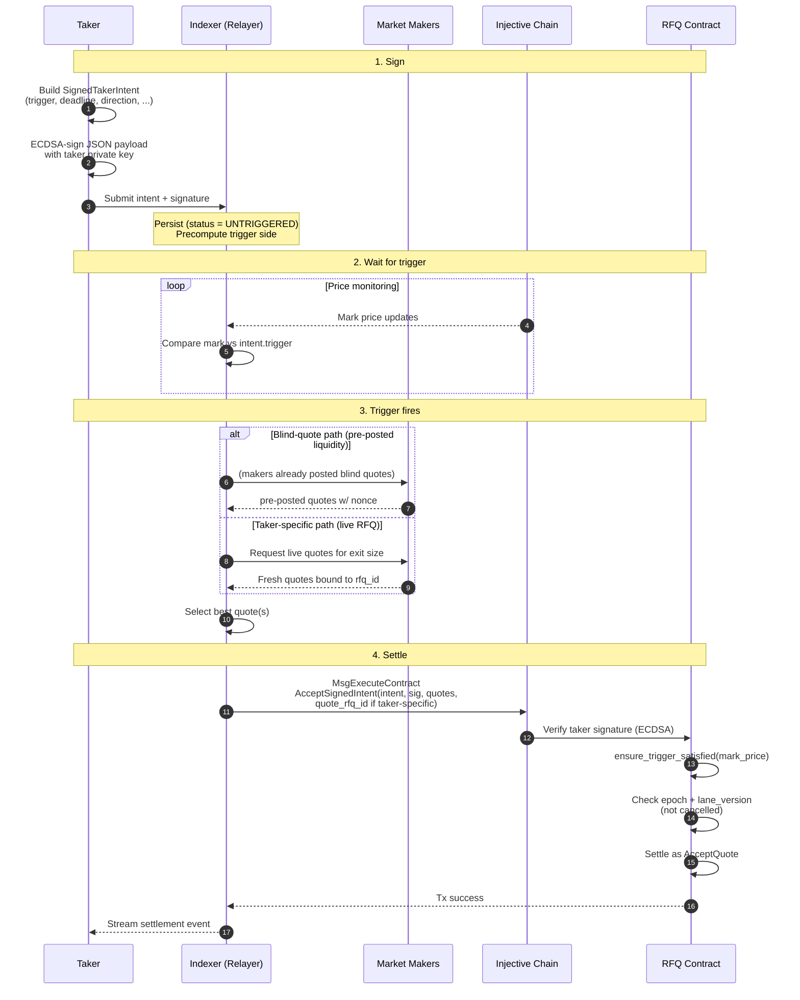

A **signed taker intent** is a pre-authorized, conditional instruction to the TrueCurrent contract. You sign the trade parameters offline, hand the signature to a relayer (the indexer's cron runs the canonical relayer), and the relayer submits `AcceptSignedIntent` onchain once the trigger condition is satisfied.

This is how **take-profit / stop-loss** orders work on TrueCurrent: you sign the exit intent at the same time as (or any time after) opening the position, and the relayer fires it when the mark price crosses your trigger.

<Warning>
**V1 scope: protective flow only.** The contract currently restricts signed intents to **zero-margin** settlements with **no orderbook fallback** (`unfilled_action` must be `null`). In practice this means signed intents are for exiting an existing position, not opening or adjusting margin. Both quote binding modes are supported: **blind quotes** (nonce-based, pre-posted) and **taker-specific quotes** (bound to a live `rfq_id`), gated by the optional `quote_rfq_id` field on `AcceptSignedIntent` — see [Quote binding modes](#quote-binding-modes) below.
</Warning>

---

## When to use signed intents

Use this mechanism when **you can't be online to submit at the right moment**, but you can sign in advance for the condition that should trigger the trade. Today that's:

- **Take-profit:** exit long at mark ≥ target price, or exit short at mark ≤ target price
- **Stop-loss:** exit long at mark ≤ stop price, or exit short at mark ≥ stop price

If you *are* online and want a trade to fire right now, use [`AcceptQuote`](/takers/accepting-quotes) — it's the direct path and doesn't need the relayer hop.

---

## End-to-end flow



---

## Message structures

### `SignedTakerIntent`

The signed payload. Every field is covered by the signature — any mutation invalidates it.

| Field | Type | Description |
|---|---|---|
| `version` | `u8` | Always `1` in v1. The contract rejects other versions. |
| `chain_id` | `string` | Must equal the runtime chain ID at execution (e.g. `injective-888` on testnet). |
| `contract_address` | `string` | Must equal the TrueCurrent contract address at execution. Prevents cross-contract replay. |
| `taker` | `string` | Your `inj1...` address — the account that will own the resulting trade. |
| `epoch` | `u64` | Your current taker epoch. Incremented by `CancelAllIntents`. Stale intents (wrong epoch) are rejected. |
| `rfq_id` | `u64` | Unique per-taker identifier. Used as a nonce against replay. |
| `market_id` | `string` | Injective derivative market hex ID. |
| `subaccount_nonce` | `u32` | Subaccount index this intent targets. Pair with `market_id` to define the *lane*. |
| `lane_version` | `u64` | Current version of the `(taker, market_id, subaccount_nonce)` lane. Incremented by `CancelIntentLane` *and* by every successful settlement. One-shot by construction. |
| `deadline_ms` | `u64` | Unix millisecond timestamp after which the intent is invalid. Max TTL is 30 days. |
| `direction` | `"long" \| "short"` | Direction of the trade to open (i.e. the exit side of your existing position). |
| `quantity` | `FPDecimal` | Size to trade, as a decimal string. |
| `margin` | `FPDecimal` | **Must be `0`** in v1 (protective flow only). |
| `worst_price` | `FPDecimal` | Hard price limit — same semantics as `AcceptQuote.worst_price`. |
| `min_total_fill_quantity` | `FPDecimal` | Minimum aggregate fill required across all quotes. If the relayer can't hit this, the whole tx reverts. Must be > 0 and ≤ `quantity`. |
| `trigger` | `Trigger` | Enum. See below. |
| `unfilled_action` | `null` | **Must be null** in v1 (no orderbook fallback for signed intents). |
| `cid` | `string \| null` | Optional client identifier echoed in the settlement event. |
| `allowed_relayer` | `string \| null` | Optional. If set, only this address can submit `AcceptSignedIntent` with this intent. Typical value: the indexer's relayer address. |

### `Trigger`

```json
// Fire immediately on first submission
{ "immediate": {} }

// Fire when mark price >= target (take-profit for longs, stop-loss for shorts)
{ "mark_price_gte": "5.20" }

// Fire when mark price <= target (stop-loss for longs, take-profit for shorts)
{ "mark_price_lte": "4.80" }
```

The contract re-evaluates the trigger at execution time. Triggers are not latched — if price moves back before the relayer lands the tx, the settlement reverts with *"trigger not satisfied"*.

### `AcceptSignedIntent` execute message

```json
{
  "accept_signed_intent": {
    "intent": { /* SignedTakerIntent JSON */ },
    "taker_signature": "Kg8z...base64...",
    "quotes": [
      {
        "maker": "inj1maker...",
        "margin": "0",
        "quantity": "100",
        "price": "5.20",
        "expiry": { "ts": 1708000800000 },
        "signature": "Sj9a...base64...",
        "nonce": 42
      }
    ],
    "quote_rfq_id": null
  }
}
```

- `taker_signature` — your ECDSA signature over the JSON-serialized `intent` object. Same secp256k1 + base64 encoding as maker quote signatures ([Accepting quotes](/takers/accepting-quotes)).
- `quotes` — one or more maker quotes. Can be a mix of **blind** (each has a `nonce`) and **taker-specific** (bound to a live `rfq_id`, no `nonce`). The mix determines whether `quote_rfq_id` is required — see [Quote binding modes](#quote-binding-modes).
- `quote_rfq_id` — *optional* `u64`. Required **iff** any quote in `quotes` is taker-specific. When set, it becomes the `rfq_id` used for settlement (instead of `intent.rfq_id`) and the contract adds a taker-nonce entry for replay protection. If every quote is blind, this field must be `null` — the contract errors on `quote_rfq_id` without taker-specific quotes.

---

## Quote binding modes

Signed intents accept either flavor of quote; the two behave differently:

| Mode | Identifier | Replay protection | When to use |
|---|---|---|---|
| **Blind** | quote carries a `nonce`, no per-taker binding | Maker-side nonce — the maker tracks consumed nonces themselves | Pre-posted liquidity. MM publishes standing "I'll fill up to X at price P" quotes; takers (or the relayer on a trigger) pick them up without the MM needing to be live at that instant. |
| **Taker-specific** | quote has no `nonce` but is bound to a live `rfq_id` | Contract-side nonce — a `taker_info` entry is inserted at settlement, keyed on the `quote_rfq_id` you pass | Live RFQ response. The relayer fires off an RFQ when the trigger hits, collects fresh signed quotes, and submits them with `quote_rfq_id` set to the id assigned by the indexer. |

The contract lets you mix both in one `quotes` array. If **any** entry is taker-specific, `quote_rfq_id` is required and applies to the whole settlement.

**Rules** (enforced by `resolve_accept_quote_rfq_id`):

- All-blind + no `quote_rfq_id` → OK (uses `intent.rfq_id` as the nonce bucket; no taker-nonce insert).
- Any-taker-specific + `quote_rfq_id` set → OK (uses the provided id; inserts a taker-nonce entry).
- Any-taker-specific + no `quote_rfq_id` → **reverts**: *"signed intent with taker-specific quotes requires quote_rfq_id"*.
- All-blind + `quote_rfq_id` set → **reverts**: *"only supported when taker-specific quotes are provided"*.

---

## Lanes, epochs, and cancellation

Signed intents are designed to be one-shot per *lane*, with two levels of cancellation:

**Lane** = `(taker, market_id, subaccount_nonce)`. Each lane has a monotonically increasing `lane_version`. An intent is tied to a specific version — once that version is consumed (by a successful settlement *or* by an explicit cancel), the signed intent is dead.

**Epoch** = per-taker global counter. Bumping it invalidates *every* outstanding intent for the taker across all lanes.

### Cancel a single lane

```json
{
  "cancel_intent_lane": {
    "market_id": "0x17ef4803...",
    "subaccount_nonce": 0
  }
}
```

Bumps `lane_version` for that lane. All outstanding intents for the lane are now stale.

Use when: you want to replace a TP/SL on one market/subaccount. You'll need to sign and submit a new intent with the new `lane_version`.

### Cancel all intents

```json
{ "cancel_all_intents": {} }
```

Bumps your taker `epoch`. Every outstanding intent anywhere becomes stale.

Use when: killswitch — e.g. you suspect your signing key is compromised, or you're migrating wallets, or you just want to rage-cancel everything.

---

## Execution semantics

At `AcceptSignedIntent` time the contract enforces, in order:

1. **Shape validation** — version must be 1, required fields non-empty, quantity > 0, margin == 0 (v1), worst_price > 0, min_total_fill_quantity > 0 and ≤ quantity, unfilled_action absent.
2. **Runtime context matches** — `intent.chain_id == env.block.chain_id`, `intent.contract_address == env.contract.address`, deadline not passed, deadline within 30-day max TTL.
3. **Quote binding resolved** — `resolve_accept_quote_rfq_id` inspects the quotes for taker-specific entries and either accepts the provided `quote_rfq_id` or reverts (see [Quote binding modes](#quote-binding-modes)).
4. **Allowed relayer** — if `intent.allowed_relayer` is set, `info.sender` must match.
5. **Taker signature valid** — ECDSA over `to_json_binary(intent)` recovers to the intent's `taker`.
6. **Epoch current** — `intent.epoch == load_taker_epoch(taker)`.
7. **Lane version current** — `intent.lane_version == load_taker_lane_version(taker, market_id, subaccount_nonce)`.
8. **Trigger satisfied** — mark price meets the trigger condition right now.
9. **Settlement** — quotes are validated and filled using the same path as `AcceptQuote`. If taker-specific quotes are present, a taker-nonce is inserted under the resolved `quote_rfq_id`.
10. **Minimum fill** — aggregate filled quantity must be ≥ `intent.min_total_fill_quantity`, otherwise the whole tx reverts.
11. **Lane advance** — on success, `lane_version` is incremented, killing any other intents for this lane.

Any check failure reverts the transaction.

---

## Signing the intent

You sign the JSON-serialized `SignedTakerIntent` with your taker private key, secp256k1 ECDSA. The contract verifies using `verify_signature(payload, signature, taker_address)` — the same primitive used for maker quote signatures.

**Steps:**

1. Build the `SignedTakerIntent` struct with every field populated (including the current `epoch` and `lane_version` from the contract).
2. JSON-encode it (CosmWasm-canonical — i.e. what `cosmwasm_std::to_json_binary` produces).
3. Hash and sign with your taker private key. Encode the 64-byte signature as base64.
4. Ship the intent + signature to the relayer (today: the TrueCurrent indexer's HTTP endpoint).

{/* TODO: add a Python + TypeScript signing snippet once the rfq-testing helper lands. Until then, the canonical reference is verify_signature() in rfq-contract/contracts/rfq/src/handler/signature.rs and the tests in test_signed_intent.rs. */}

---

## Reading the current epoch and lane version

Before signing, query the contract for your current `epoch` and `lane_version` — otherwise you'll sign against stale values and the intent will reject at execution.

{/* TODO: document the exact query message and response shape once the query entrypoints are finalized (see msg.rs TakerIntentStateResponse). */}

---

## What's deliberately out of scope in v1

- **Entry flow.** Intents can't open new positions; `margin` must be zero.
- **Orderbook fallback.** `unfilled_action` must be null. No limit/market rest behind the quote fill.
- **Relayer freedom.** If you set `allowed_relayer`, only that relayer can submit. Today this will typically point at the indexer's relayer address to stop random parties from front-running your trigger.

**Note:** v1 *did* previously require blind-quote-only settlement. That restriction was lifted in [`InjectiveLabs/rfq#27`](https://github.com/InjectiveLabs/rfq/pull/27) (contract `0.1.0-alpha.6`) — taker-specific quotes are now supported alongside blind quotes, gated by the `quote_rfq_id` field documented above.

The design leaves room to expand — higher version numbers will carry richer semantics — but any integration you build today should assume v1 constraints.

---

## Next

- [Accepting quotes](/takers/accepting-quotes) — the synchronous `AcceptQuote` path, which shares most of the settlement logic with `AcceptSignedIntent`.
- [Best practices](/takers/best-practices) — expiry races, idempotency, and `cid` usage all apply equally to signed intents.
