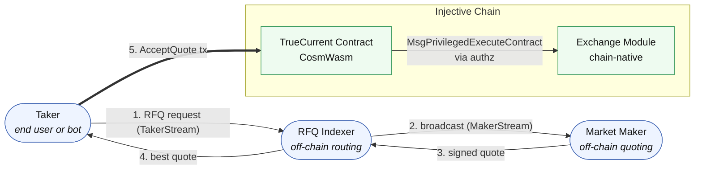
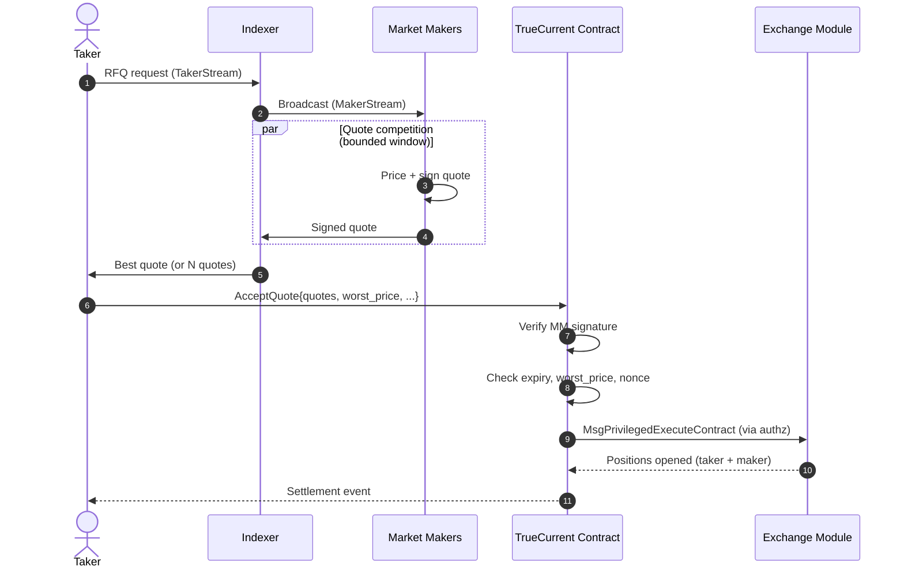

TrueCurrent is composed of three main layers: an off-chain quote distribution layer, an onchain smart contract, and Injective's native exchange module for final settlement.

---

## System overview

**Reading the diagram.** Steps 1–4 happen off-chain over WebSocket inside a single quote window — typically sub-second. Step 5 is one on-chain transaction that atomically opens both the taker's and the market maker's position and, optionally, routes any remainder to the orderbook.

---

## Components

### RFQ Indexer (off-chain)

The indexer is TrueCurrent's off-chain coordination layer. It:

- Maintains the registry of whitelisted market maker addresses
- Operates the **TakerStream** WebSocket (for traders submitting requests)
- Operates the **MakerStream** WebSocket (for market makers receiving requests and submitting quotes)
- Routes requests to all active market makers
- Collects and forwards quotes back to traders
- Selects the best quote for presentation

The indexer is a coordination layer only – it never holds funds or executes trades. Its role is purely informational: passing messages between traders and market makers. Even if the indexer were to behave maliciously, it could not forge a market maker's signature or alter the terms of a quote.

### TrueCurrent smart contract (onchain)

Deployed on Injective as a CosmWasm contract, the TrueCurrent contract is the trust anchor of the system. It:

- Verifies market maker signatures on each `AcceptQuote` call
- Enforces the trader's `worst_price` constraint
- Checks quote expiry
- Confirms both parties have sufficient margin
- Executes the settlement through Injective's exchange module using pre-granted `authz` permissions
- Routes any unfilled quantity to the Injective order book

The contract's logic is deterministic and publicly verifiable. All settlement decisions are made onchain.

### Injective exchange module

Injective has a native exchange module built into the chain consensus layer – not a smart contract, but a chain-level primitive. The TrueCurrent contract uses `MsgPrivilegedExecuteContract` to call into this module for final position settlement.

The exchange module handles:
- Margin accounting and position tracking
- Liquidation engine
- Funding rate calculations and payments
- Onchain order book (used for fallback fills)

---

## Data flow: full trade lifecycle

Step-by-step:

1. **Trader → Indexer (TakerStream):** Trader sends an RFQ request over WebSocket
2. **Indexer → All MMs (MakerStream):** Request is broadcast to all active makers simultaneously
3. **MMs → Indexer (MakerStream):** Each maker responds with a signed quote within 2 seconds
4. **Indexer → Trader (TakerStream):** Best quote is returned to the trader
5. **Trader → Chain (AcceptQuote):** Trader submits the `AcceptQuote` transaction with the quote and their parameters
6. **Contract verification:** Onchain contract verifies signature, price, expiry, and margin
7. **Settlement (exchange module):** Contract uses `authz` to open positions for both taker and maker through Injective's exchange module
8. **Position update:** Both wallets' subaccounts reflect the new positions

For the conditional / TP-SL variant, substitute steps 1–5 with the [signed taker intent](/takers/signed-intents) flow: the taker signs in advance, a relayer submits `AcceptSignedIntent` when the trigger is satisfied. Steps 6–8 are the same.

---

## Trust model

**Who you trust when trading on TrueCurrent:**

- **The TrueCurrent smart contract** – open source, onchain, deterministic. Verifiable by anyone.
- **Injective chain and validators** – for block finality and execution of the exchange module.
- **The RFQ indexer** – only for routing. It cannot steal funds or alter prices. At worst, a malicious indexer could drop requests (degraded service), but couldn't cause unauthorized trades.

**What you do not need to trust:**

- Individual market makers to honor prices – the signature enforces it onchain
- TrueCurrent to hold or secure your funds – assets stay in your subaccount at all times
- Centralized infrastructure for settlement – all final settlement is onchain
