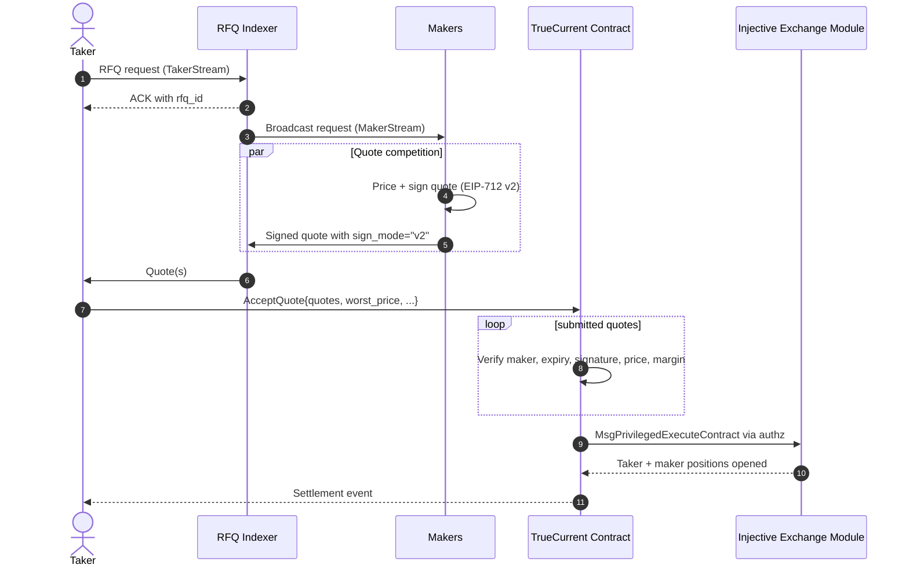
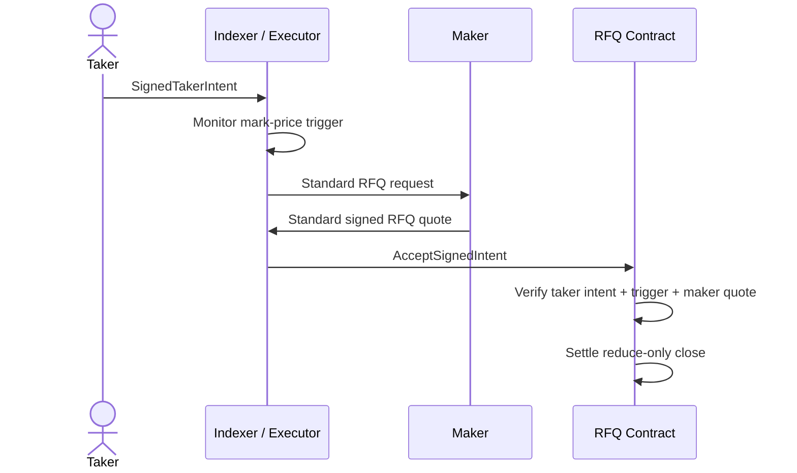

This page is the protocol-level companion to [RFQ explained](/overview/rfq-explained). It focuses on message flow, timing, signatures, and settlement checks.

---

## End-to-end `AcceptQuote` flow

The first part is offchain and latency-sensitive. The final settlement is one onchain transaction that atomically opens both sides. There is no state where only the taker or only the maker receives a position.

---

## Timing model

| Phase | Typical budget |
| --- | --- |
| Taker request ACK | one stream round trip |
| Maker pricing and signing | a few hundred milliseconds |
| Taker quote collection | 500 ms on TrueCurrent; configurable by protocol, frontend, or API taker |
| `AcceptQuote` broadcast and inclusion | Injective block timing |

The TrueCurrent frontend currently uses a 500 ms quote collection window. The value can vary by frontend and protocol configuration, and API takers can tune their own `collect_quotes` timeout. Longer collection windows may receive more quotes, but they leave less of each quote's expiry budget for transaction inclusion.

Maker quotes must have at least 1500 ms of validity when submitted. A common live quote expiry is `expiry = now_ms + 2_000`; longer expiries give a quote more time to be selected and settled, but increase stale-price exposure for the maker. Taker collection and chain inclusion both consume that window, so makers should avoid slow network calls after receiving a request and should keep host clocks synchronized.

---

## What a maker signs

Every live maker quote is an EIP-712 v2 signature over `SignQuote`. The digest binds:

- EVM chain ID (`1439` testnet, `1776` mainnet)
- RFQ contract address converted from bech32 to EVM address
- Market ID
- RFQ ID
- Taker address and direction
- Taker margin and quantity
- Maker address and maker subaccount nonce
- Maker margin and quantity
- Price
- Expiry
- Minimum fill quantity
- Binding kind (`1` for current taker-bound RFQ quotes)

Decimal fields are hashed as their exact UTF-8 strings. `"14.85"` and `"14.850"` are different signed messages. Quantize and canonicalize before signing, then send the exact same strings on the wire.

For implementation details, see [Building & signing quotes](/sdk-trading/signing-quotes).

---

## What `AcceptQuote` validates

When `AcceptQuote` lands, the contract processes submitted quotes in order. Per quote, it checks:

| Check | If it fails |
| --- | --- |
| Quote expiry is still valid | Quote is skipped |
| Maker is registered | Quote is skipped |
| Maker nonce / RFQ ID has not replayed | Quote is skipped |
| EIP-712 v2 signature recovers the maker | Quote is skipped |
| Quote satisfies taker `worst_price` | Quote is skipped |
| Quote stays inside the mark-price validation band | Quote is skipped |
| Maker has enough available margin | Quote is skipped |
| Fill will not violate maker `min_fill_quantity` | Quote is skipped |

After the loop, at least one quote must fill. If every quote is skipped, the transaction fails with no trade.

---

## Settlement

Once at least one quote is accepted, the contract calls Injective's exchange module through `MsgPrivilegedExecuteContract` using the taker and maker authz grants. The exchange module handles:

- Moving margin into the relevant subaccounts
- Opening the taker's derivative position
- Opening each maker's opposite-side derivative position
- Emitting settlement state that downstream systems can reconcile

The taker's fill price is the accepted maker quote price. The maker's exposure is the opposite side of the taker's trade.

---

## Conditional TP/SL path

`AcceptSignedIntent` is the conditional settlement path for take-profit and stop-loss exits.

The taker signs in advance; the executor submits only when the trigger condition is satisfied. The contract re-checks the trigger at execution time. If mark price moves back before the transaction lands, settlement can fail with `trigger_not_satisfied` and the executor should retry according to its trigger-order policy.

Makers see the liquidity request as a normal MakerStream RFQ and quote it normally. TP/SL-specific intent state is not part of the maker integration. For taker intent signing, see [Signed intents](/sdk-trading/signed-intents).

---

## Why RFQ-only

TrueCurrent's public product settles through signed RFQ quotes. That keeps execution auditable: the fill price is the price a maker signed, and the contract enforces it. If no acceptable quote is available, no trade settles and the taker can request fresh quotes.

Related pages:

- [SDK architecture](/sdk-trading/architecture)
- [Maker SDK trading](/sdk-trading/makers)
- [Taker SDK trading](/sdk-trading/takers)
- [Smart contract](/technical/smart-contract)
