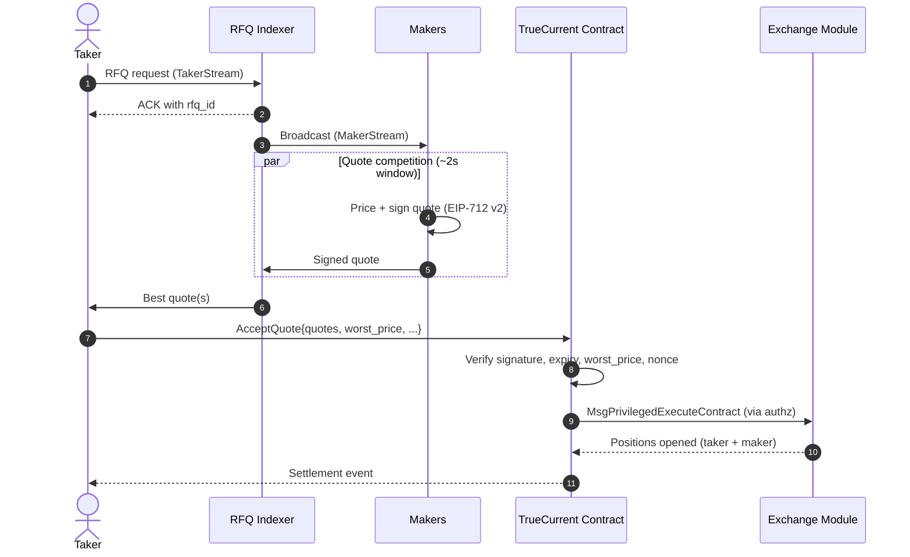

This page is the protocol-level companion to [RFQ explained](/overview/rfq-explained). Read that first if you want the conceptual case for RFQ. This page focuses on the wire flow, timing, and what the smart contract actually checks at settlement.

---

## End-to-end flow

Steps 1–4 happen off-chain over WebSocket inside a single quote window — typically sub-second. Step 5 is one on-chain transaction that atomically opens both the taker's and the maker's positions.

---

## Timing budget

| Phase | Duration |
|---|---|
| Indexer broadcasts request | ~10 ms |
| Maker prices + signs + returns quote | a few hundred ms |
| Taker quote collection | a few hundred ms to less than the live quote expiry window |
| Taker selects best quote and broadcasts `AcceptQuote` | ~100 ms |
| Injective block time | ~600 ms |
| **Total wall-clock** | **roughly 1 second once quotes start arriving** |

Live quotes are signed with `expiry = now + 2_000` ms. The contract rejects any quote whose `expiry` has passed at block time.

---

## What gets signed

Every maker quote is signed with EIP-712 v2 over a `SignQuote` typed-data struct. The signature covers — in field order — the EVM chain ID, market ID, RFQ ID, taker address, taker direction, taker margin, taker quantity, maker address, maker subaccount nonce, maker quantity, maker margin, price, expiry kind + value, min fill quantity, and a binding kind derived from whether `taker` is set.

For the maker-side integration path, see [Maker SDK trading](/sdk-trading/makers).

The taker does not sign anything for `AcceptQuote` itself — the transaction is broadcast under the taker's private key in the standard Cosmos SDK way. For TP/SL exits, the taker pre-signs a `SignedTakerIntent` (also EIP-712 v2); see [Taker SDK trading](/sdk-trading/takers).

---

## On-chain validation

When `AcceptQuote` lands, the contract walks the `quotes` array in submission order and runs these checks per quote:

| Check | Failure mode |
|---|---|
| Quote `expiry` not passed | Skip with "quote expired" |
| Maker is currently whitelisted | Skip with "unknown maker" |
| Maker has not already used this `rfq_id` nonce | Skip with "nonce replay" |
| Signature verifies against canonical quote payload | Skip with "signature mismatch" |
| Quote `price` is within taker's `worst_price` | Skip with "price exceeds worst_price" |
| Maker has sufficient available balance for their margin | Skip with "insufficient maker balance" |
| Filling this quote wouldn't fall below maker's `min_fill_quantity` | Skip with "below min fill" |

A failed check skips that quote and continues with the next — the transaction does not abort. After the loop, the contract requires at least one quote filled; otherwise the transaction fails with `all quotes rejected`. See [Taker SDK trading](/sdk-trading/takers) for the taker-side settlement flow.

---

## Settlement

Once the loop has accumulated filled quotes, the contract calls Injective's exchange module via `MsgPrivilegedExecuteContract` (under pre-granted `authz`) to:

1. Open the taker's position (long or short)
2. Open each maker's opposing position (short or long), sized to that maker's filled quantity

Both sides settle atomically in the same Injective block. There is no partial state where one side has a position and the other doesn't. Margin moves are bundled into the same transaction.

For the contract message structure, queries, and the full settlement event payload, see [Smart contract](/technical/smart-contract).

---

## Why RFQ-only

TrueCurrent's contract has hooks for orderbook fallback, but the public product is RFQ-only — every trade is a signed-quote settlement. This keeps the trust story simple: the only execution price is the one a maker signed, and the contract enforces it. There is no path where a different price lands than the one displayed.

If RFQ collects no acceptable quotes, the request is cancelled, your margin is released, and you can submit a new request immediately. See [Understanding quotes](/trading/understanding-quotes) for the collection-window semantics.

---

## Related pages

- [RFQ explained](/overview/rfq-explained) — the user-facing case for RFQ vs AMMs and order books
- [Architecture](/technical/architecture) — system layers, trust model, what the indexer does
- [Smart contract](/technical/smart-contract) — `AcceptQuote` message, queries, settlement event
- [Maker SDK trading](/sdk-trading/makers) — maker setup, MakerStream, quote signing, and quote operations
- [Taker SDK trading](/sdk-trading/takers) — taker setup, quote collection, settlement, and signed intents
